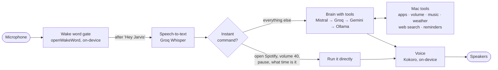

# JARVIS

A voice-first assistant for macOS. Say **"Hey Jarvis"**, ask for something, and it answers out loud and gets it done on your Mac: opening apps, controlling music and volume, checking the weather, searching the web, setting reminders.

It is designed to run **for free on a base MacBook (M1, 8 GB RAM)**: the small, latency-critical models run on the Mac, and the large-language-model "brain" uses free cloud tiers (Mistral, Groq, Gemini) with automatic failover between providers.

> **Status:** Phase 1 (voice core + Mac control). See the [roadmap](#roadmap).

## How it works



Built on [Pipecat](https://github.com/pipecat-ai/pipecat), an open-source framework for realtime voice agents. Pipecat handles audio streaming, voice activity detection and interruptions; everything in `jarvis/` is this project.

### Design decisions

| Problem | Decision |
|---|---|
| **Free tiers have daily limits.** Background conversation would burn speech-to-text quota. | A **wake-word gate** (`jarvis/wake.py`) runs openWakeWord on-device on every 80 ms of audio and drops it until it hears "Hey Jarvis". Nothing leaves the Mac until then. |
| **A free provider hitting its limit should not mean silence.** Pipecat's built-in failover only switches on permanent errors (bad key), not on rate limits. | A custom failover strategy (`jarvis/failover.py`) treats 429s and exhausted quotas as failover reasons, benches the provider for a cooldown (1 min for rate limits, 1 h for quotas), retries the same request on the next provider, and switches back once the cooldown ends. |
| **Simple commands shouldn't wait on an LLM.** | An **instant-command path** (`jarvis/fastpath.py`) matches commands like "open Spotify" or "volume 40" with patterns and runs them directly, with no LLM call. If a command fails (an unknown app name, say), the request falls through to the brain. |
| **Free tiers run out.** Long sessions resend the whole conversation with every request, and background noise turns into speech-to-text calls. | The conversation is cleared each time Jarvis goes back to sleep and capped at six exchanges while awake; noise and empty transcripts are dropped before the brain; replies are capped at 300 tokens; timers, alarms, system controls and browser searches run as instant commands. `jarvis usage` shows what's left. |
| **Big models are slow and use more quota; small ones can't plan.** | `jarvis/router.py` sends multi-step or "thinking" requests (plan, compare, write…) to a larger model (Ministral 14B on the free plan) and everything else to a faster one (Ministral 8B), using string rules on the Mac, so choosing costs no API call. |
| **8 GB of RAM.** A fully local stack (LLM + Whisper + TTS) would push macOS into swap. | Only the small models run locally (wake word, voice activity, Kokoro voice, about 1–1.5 GB in total). The brain runs in the cloud, with an optional local Ollama model as an offline fallback. |
| **Laptop speakers feed back into the microphone.** Jarvis heard itself, took it as the user interrupting, and stopped after one word. It could also wake itself by saying "Hey Jarvis". | The gate drops microphone audio while Jarvis speaks and for a short echo tail after; Pipecat's user-mute strategy backs it up. Interrupting is opt-in for headphone users. |
| **Switching provider mid-conversation.** Gemini leaves Gemini-only "thought signatures" in the context, which other providers can't read. | On every switch, provider-specific messages from other providers are dropped from the context. |
| **Not lying about actions.** | Every tool returns `ok` plus a message and never raises, and the persona prompt forbids claiming an action succeeded when it didn't. |

## Setup (macOS, Apple Silicon)

```bash
# 1. System packages
brew install python@3.12 portaudio

# 2. Install
git clone https://github.com/rayankhan2003/jarvis.git && cd jarvis
python3.12 -m venv .venv && source .venv/bin/activate
pip install -e .

# 3. Free API keys (no credit card)
cp .env.example .env
#   MISTRAL_API_KEY → https://console.mistral.ai/api-keys  (Experiment plan)
#   GROQ_API_KEY    → https://console.groq.com/keys        (also used for speech-to-text)
#   GEMINI_API_KEY  → https://aistudio.google.com/apikey    (optional backup)

# 4. Check everything and measure the response time on your Mac
jarvis doctor

# 5. Run
jarvis
```

The first run downloads the voice (~330 MB) and wake-word models (~4 MB). Allow microphone access for your terminal when macOS asks. Opening and quitting apps also needs **Automation** permission, which macOS asks for the first time Jarvis controls each app.

By default Jarvis ignores the microphone while it is speaking, so it works on laptop speakers without cutting itself off. With headphones, set `JARVIS_INTERRUPTIONS=1` to be able to talk over it.

## What you can say

| Say | What happens | Path |
|---|---|---|
| "Hey Jarvis, open Spotify" / "quit Safari" | Opens or quits the app | instant |
| "Volume 40" / "turn it up" / "mute" | Sets the volume | instant |
| "Pause" / "next song" / "what's playing?" | Controls Spotify, or Apple Music if Spotify isn't running | instant |
| "What time is it?" / "How much battery do I have?" | Answers straight away | instant |
| "Set a timer for 10 minutes" / "how much time is left?" / "cancel the timer" | Countdown on the Mac; Jarvis speaks, notifies and plays a sound when done | instant |
| "Set an alarm for 7:30 am" / "wake me up at 6 in the morning" | Alarm while Jarvis is running | instant |
| "Dark mode" / "light mode" / "make it brighter" / "dim the screen" | Changes appearance or brightness | instant |
| "Take a screenshot" / "put the Mac to sleep" | Screenshot to the Desktop / sleeps the Mac | instant |
| "Lock the screen" | Puts the display to sleep (locks if your Mac requires a password on wake) | instant |
| "Open Brave and search Talha Anjum" / "search Kaavish on YouTube" / "google cricket score" | Opens the results in that browser (or your default one) | instant |
| "What's the weather in Peshawar?" | Gets the weather from wttr.in | brain |
| "What's new in the latest Next.js release?" | Searches DuckDuckGo quietly and answers out loud | brain |
| "Remind me to submit the assignment at 6" | Adds the reminder to Reminders | brain |
| "Open Spotify, play something, and set the volume to 30" | Plans and runs several tools in a row | brain |
| "Open YouTube in Brave" / "go to GitHub" | Opens the site (YouTube, GitHub, Gmail, ChatGPT, LinkedIn…) | instant |
| "That's all" | Jarvis goes back to sleep | instant |
| "Shut down" / "close Jarvis" | Says goodbye and quits Jarvis | instant |

Try instant commands without speaking: `jarvis say "volume 30"`. See today's free-tier usage with `jarvis usage`.

## Configuration

All settings live in `.env`; see [`.env.example`](.env.example). The most useful ones:

- `JARVIS_VOICE`: Kokoro voice (`bm_george`, `bm_lewis`, `bm_daniel`, `bm_fable`, …)
- `JARVIS_USER_NAME`, `JARVIS_HONORIFIC`: how Jarvis addresses you
- `JARVIS_INTERRUPTIONS=1`: talk over Jarvis to interrupt it (headphones only)
- `JARVIS_WAKE_THRESHOLD`: lower it if Jarvis misses "Hey Jarvis", raise it if it wakes by itself
- `JARVIS_BRAIN_ORDER`: which providers to try first, e.g. `groq,mistral,gemini` if Groq is faster for you
- `MISTRAL_MODEL`, `MISTRAL_COMPLEX_MODEL`: the everyday and complex-request models
- `OLLAMA_MODEL`: optional offline brain, e.g. `qwen3.5:4b`
- `JARVIS_LOCAL_STT=1`: transcribe on the Mac with MLX Whisper (`pip install -e ".[local-stt]"`)

## Development

```bash
pip install -e ".[dev]"
pytest          # unit tests plus processors run inside real Pipecat pipelines; no Mac needed
ruff check .
```

```
jarvis/
  bot.py        pipeline assembly
  wake.py       on-device wake word gate
  fastpath.py   instant commands
  failover.py   free-tier failover between LLM providers
  router.py     small vs large model per request, without an API call
  conversation.py  keeps the context sent to the brain small
  usage.py      local free-tier usage counter (`jarvis usage`)
  timers.py     timers and alarms
  persona.py    system prompt
  doctor.py     `jarvis doctor` setup and latency checks
  tools/        Mac control (system.py) and lookups (info.py)
```

## Roadmap

- [x] **Phase 1: Voice core.** Wake word, realtime voice with interruptions, instant commands, free-tier failover, Mac control, `jarvis doctor`
- [x] **Free-tier savings.** Mistral with small/large routing, context clearing, noise filtering, usage counter
- [x] **Timers, alarms and system controls** as instant commands
- [ ] **Phase 2: Hands.** Files, terminal and git with confirmation before anything risky; Calendar through EventKit
- [ ] **Phase 3: Memory and eyes.** Long-term memory of preferences and projects; "what's on my screen?"
- [ ] **Phase 4: HUD.** A Three.js interface that shows the voice, tool calls and system status live
- [ ] **Phase 5: Proactive.** Morning briefing, meeting and build-failure alerts

## Credits and licences

- Code in this repository: MIT
- [Pipecat](https://github.com/pipecat-ai/pipecat): BSD 2-Clause
- [openWakeWord](https://github.com/dscripka/openWakeWord): Apache 2.0; its pre-trained **"hey jarvis" model is CC BY-NC-SA 4.0 (non-commercial use only)**
- [Kokoro](https://huggingface.co/hexgrad/Kokoro-82M) voice model: Apache 2.0
